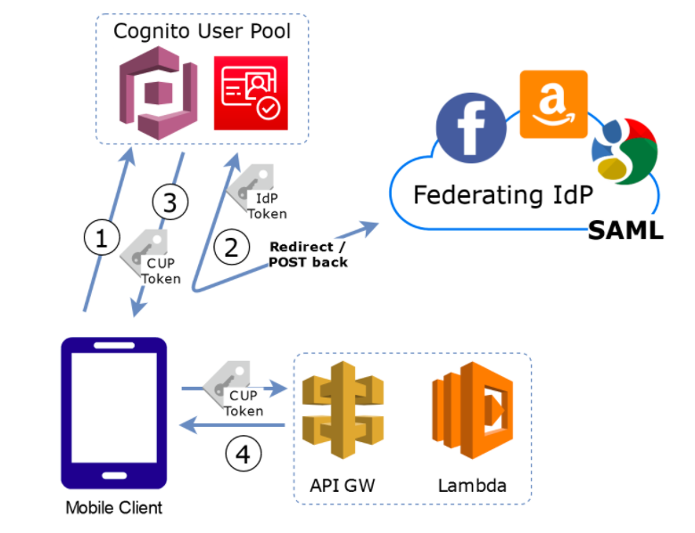
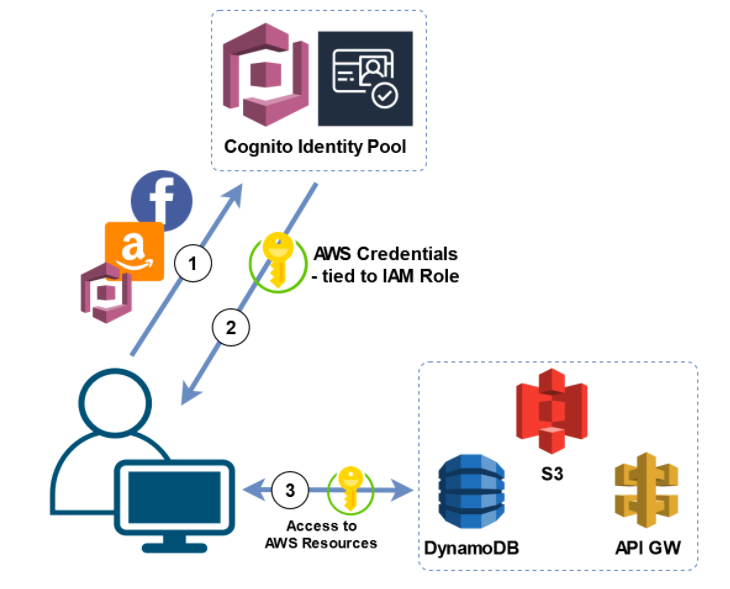
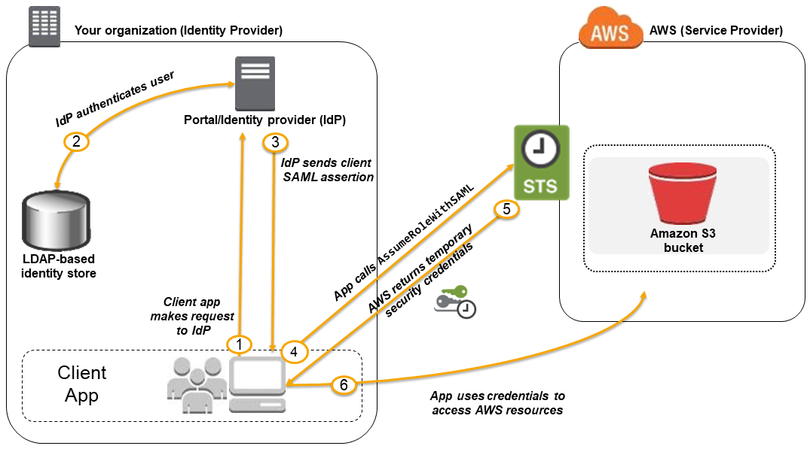
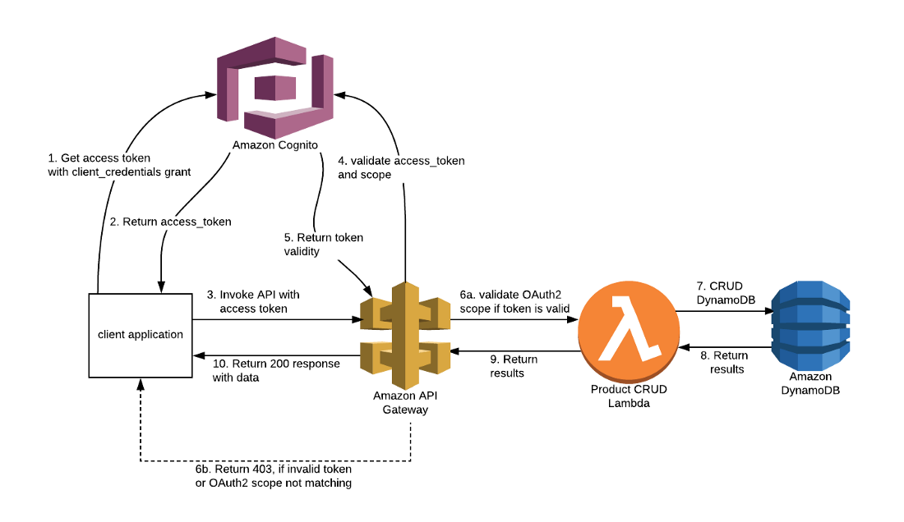
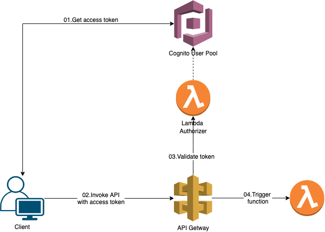

# AWS Cognito

Before discussing Amazon Cognito, it is first important to understand what Web Identity Federation is. 

**Web Identity Federation** lets you give your users access to AWS resources after they have successfully authenticated into a web-based identity provider such as Facebook, Google, Amazon, etc. 
Following a successful login into these services, the user is provided an auth code from the identity provider which can be used to gain temporary AWS credentials.

Amazon Cognito is the Amazon service that provides Web Identity Federation. You don’t need to write the code that tells users to sign in for Facebook or sign in for Google on your application. Cognito does that already for you out of the box.

Once authenticated into an identity provider (say with Facebook as an example), the provider supplies an auth token. This auth token is then supplied to cognito which responds with limited access to your AWS environment. You dictate how limited you would like this access to be in the IAM role.

To summarize, **Cognito's job is to broker between your app and legitimate authenticators**.

**Cognito User Pools** are user directories that are used for sign-up and sign-in functionality on your application. Successful authentication generates a JSON web token. Remember user pools to be user based. It handles registration, recovery, and authentication.

**Cognito Identity Pools** are used to allow users temp access to direct AWS Services like S3 or DynamoDB. Identity pools actually go in and grant you the IAM role.

SAML-based authentication can be used to allow AWS Management Console login for non-IAM users.
* You can use Microsoft Active Directory which implements Security Assertion Markup Language (SAML) as well.
* You can use Amazon Cognito to deliver temporary, limited-privilege credentials to your application so that your users can access AWS resources.
* Amazon Cognito identity pools support **both authenticated and unauthenticated identities**.
* You can retrieve a unique Amazon Cognito identifier (identity ID) for your end user immediately if you're allowing unauthenticated users or after you've set the login tokens in the credentials provider if you're authenticating users.
* When you need to easily add authentication to your mobile and desktop app, think Amazon Cognito.

## Cognito User Pools vs Identity Pools

**Cognito User Pools** are used for authentication. To verify your user’s identity, you will want to have a way for them to login using username/passwords or federated login using Identity Providers such as Amazon, Facebook, Google, or a SAML supported authentication such as Microsoft Active Directory. You can configure these Identity Providers on Cognito, and it will handle the interactions with these providers so you only have to worry about handling the Authentication tokens on your app.

With Cognito User Pools, you can provide sign-up and sign-in functionality for your mobile or web app users. You don’t have to build or maintain any server infrastructure on which users will authenticate. 

This diagram shows how **authentication** is handled with Cognito User Pools:

1. Users send authentication requests to Cognito User Pools. 
2. The Cognito user pool verifies the identity of the user or sends the request to Identity Providers such as Facebook, Google, Amazon, or SAML authentication (with Microsoft AD).
3. The Cognito User Pool Token is sent back to the user. 
4. The person can then use this token to access your backend APIs hosted on your EC2 clusters or in API Gateway and Lambda.  

If you want a quick login page, you can even use the pre-built login UI provided by Amazon Cognito which you just have to integrate on your application.

**Cognito Identity Pools** (Federated Identities) provides different functionality compared to User Pools. Identity Pools are used for User Authorization. You can create unique identities for your users and federate them with your identity providers. Using identity pools, users can obtain temporary AWS credentials to access other AWS services. 

Identity Pools can be thought of as the actual mechanism authorizing access to AWS resources. When you create Identity Pools, think of it as defining who is allowed to get AWS credentials and use those credentials to access AWS resources.

This diagram shows how **authorization** is handled with Cognito Identity Pools:

1. The web app or mobile app sends its authentication token to Cognito Identity Pools. **The token can come from a valid Identity Provider, like Cognito User Pools, Amazon, Google, or Facebook**. 
2. Cognito Identity Pool exchanges the user authentication token for temporary AWS credentials to access resources such as S3 or DynamoDB. AWS credentials are sent back to the user. 
3. The temporary AWS credentials will be used to access AWS resources.   
You can define rules in Cognito Identity Pools for mapping users to different IAM roles to provide fine-grain permissions. 

Here’s a table summary describing Cognito User Pool and Identity Pool:

|Cognito User Pools | Cognito Identity Pools |
|---|---|
| Handles the IdP interactions for you|	Provides AWS credentials for accessing resources on behalf of users|
| Provides profiles to manage users	| Supports rules to map users to different IAM roles|
| Provides OpenID Connect and OAuth standard tokens| |
| Priced per monthly active user | Free |	

## AWS Security Token Service (STS)
AWS Security Token Service (AWS STS) is the service that you can use to create and provide trusted users with temporary security credentials that can control access to your AWS resources.

* Temporary security credentials work almost identically to the long-term access key credentials that your IAM users can use.
* Temporary security credentials are short-term, as the name implies. They can be configured to last for anywhere from a few minutes to several hours. After the credentials expire, AWS no longer recognizes them or allows any kind of access from API requests made with them.

# ID Token vs Access Token

When we sign in the Cognito user pool we will obtain all these three tokens. 
1. **The ID token** contains claims about the identity of the authenticated user such as name, email, and phone_number.
2. **The access token** contains scopes and groups and is used to grant access to authorized resources.
3. **The refresh token** contains the information necessary to obtain a new ID or access token.

### Which Token to Call API?
Normally, **the ID token is for Authentication, and the access token is for Authorization**. When calling the API method, we typically set the token to the request's Authorization header. So, it sounds like we should use the access token, doesn't it? Based on the doc, we could use either the ID token or the access token. However,  as we tested, we should use the ID token. That's because:

The ID token is used to authenticate users to our resource servers or server applications (ex: API)  
The purpose of the access token is to authorize API operations in the context of the user in the user pool. For example, you can use the access token to grant your user access to add, change, or delete user attributes.

# Use API Gateway with Cognito

When API Gateway uses an Amazon Cognito token for authentication, **it validates the token locally without directly communicating with Amazon Cognito to verify that the token belongs to the same AWS account**. Here's how it works:

### How API Gateway Validates Tokens
1. **Decoding the Token:**
    - API Gateway decodes the JSON Web Token (JWT) using the **public key from the JWKS (JSON Web Key Set) endpoint of the Cognito User Pool**. This public key is specific to the User Pool and can be used to validate tokens issued by that User Pool.
2. **Validating the Token:**
    - API Gateway checks:
        - The **signature** of the token to confirm it is issued by the corresponding Cognito User Pool.
        - The **issuer (iss) claim**, which should match the User Pool's URL (e.g., https://cognito-idp.<region>.amazonaws.com/<user_pool_id>).
        - The **audience (aud) claim**, which should match the app client ID associated with the User Pool.
        - The **expiration (exp) claim**, ensuring the token is still valid.
    
### No Communication with Cognito
- API Gateway does not call Cognito to verify the token's validity or confirm that it belongs to the same AWS account.
- Validation is purely based on the token's signature and claims. As long as the token is valid and meets the above criteria, API Gateway will allow access.

### Implications
- If the token is forged but contains the correct signature and claims, it will pass validation. However, forging a token is practically impossible if the private key of the User Pool is secure.
- Revocation or invalidation of tokens (e.g., if a user is disabled in the User Pool) **is not checked by API Gateway**. This is because API Gateway doesn't interact with Cognito at runtime. To handle such cases, you might need additional custom logic in your backend.

### How to Enhance Security
1. **Use Short-Lived Tokens:** Configure access tokens to have a short TTL (Time-To-Live) to minimize risk.
2. **Custom Authorizers:**
    - You can implement a Lambda authorizer in API Gateway to perform additional checks, such as querying Cognito to confirm the token is still valid and belongs to the correct AWS account.
3. **Regularly Rotate App Client Secrets:** Ensure app client secrets used by your User Pool are securely stored and rotated periodically.

This design avoids unnecessary calls to Cognito, improving performance and scalability, but shifts the responsibility for additional security checks to the developer if needed.

# Control access to a REST API using Amazon Cognito user pools as authorizer

A common design scenario is to build a common security layer around the API gateway, so that all the APIs are secured. There are multiple ways to build API security like writing some filters in the case of Java / J2EE application, installing some agents in front of APIs which can make policy decisions etc. One of the most widely used protocol for Authorization is OAuth2. AWS API Gateway provides built-in support to secure APIs using AWS Cognito OAuth2 scopes.

this is how it works
1. Invoke AWS Cognito /oauth2/token endpoint with grant_type as client_credentials. Refer https://docs.aws.amazon.com/cognito/latest/developerguide/token-endpoint.html
2. If the request is valid, AWS Cognito will return a JWT (JSON Web Token) formatted access_token
3. Pass this token in Authorization header for all API calls
4. API Gateway makes a call to AWS Cognito to validate the access_token.
5. AWS Cognito returns token validation response.
6. If token is valid, API Gateway will validate the OAuth2 scope in the JWT token and ALLOW or DENY API call. This is entirely handled by API Gateway once configuration is in place
7. Perform the actual API call whether it is a Lambda function or custom web service application.
8. Return the results from Lambda function.
9. Return results to API Gateway.
10. If there are no issues with the Lambda function, API Gateway will return a HTTP 200 with response data to the client application.

# Using a Custom Authorizer 

In our API gateway, we wanted to validate some email domains before allowing access to the API calls, even if the users are authenticated by the cognito pool.

ie. even for users available+authenticated in the cognito user pool we wanted to restrict access to our api calls (authorization)

The two options available are
1. We validate the user in downstream lambda and based on the username/email return error
2. We use a custom lambda authorizer as discussed below

The problem with this change is that you need to reimplement what previous the Cognito authorizer did before and on top of that to put your logic. This is handled by the lambda (calling cognito in background for authenticating + custom authorization)

The lambda returns a policy which accepts or denies the API gateway access based.

We can enable Authorization Caching on this lambda, so that we dont trigger the lambda every time

## Can you use Cognito for user management for your application, say a Facebook/Twitter clone? 

**You absolutely can!** Cognito User Pool is a serverless database of users for your web & mobile Apps.  
You get features like
1. Username (or email) / password combination
2. Password reset functionality
3. Email & Phone number Verification
4. Multi-factor Authentication
5. Federated Identities: users from Facebook, Google, SAML
6. Feature to Block users if their credentials are compromised elsewhere
7. Integrated with Services like API Gateway and Application Load Balancer (using listeners and rules)

### Compare AWS Cognito vs maintaining your own database for user management

AWS Cognito is a managed service that simplifies user authentication, authorization, and user management. It is best suited if:
* You want quick setup and scalability: 
    * Cognito offers ready-to-use features for user sign-up/sign-in, multi-factor authentication (MFA), and OAuth2 support, allowing you to focus on application logic rather than managing authentication infrastructure.
* You don’t want to handle sensitive user data directly:
    * Cognito securely manages sensitive data like passwords and ensures compliance with standards such as GDPR, HIPAA, etc.
* Your application needs federated identity support:
    * It easily integrates with third-party identity providers (Google, Facebook, Apple, etc.) and enterprise identity solutions like SAML or OpenID Connect.
* Cost efficiency for **low-medium user bases**:
    * AWS Cognito is cost-effective for projects with small to medium-sized user bases. Costs can increase for high-usage apps due to its pricing model based on monthly active users.
* Limited customization requirements:
    * While Cognito is highly capable, its customization options for user data and workflows are limited compared to a fully managed database.

Maintain Your Own User Database offers greater flexibility but requires more effort. This option is better if:
* You need highly customized user workflows:
    * If your app requires extensive custom logic, attributes, or user management flows that go beyond Cognito’s capabilities, having your own database provides more control.
* You have complex reporting and analytics needs:
    * A dedicated database allows you to build custom queries, generate reports, and analyze user data as required.
* You need full control over infrastructure:
    * For enterprise-grade applications with specific compliance or security needs, hosting your own user database ensures that you have full control over how and where data is stored.
* You’re prepared to manage security and scaling:
    * Managing your database requires robust security practices for password hashing, encryption, and authentication protocols. It also means planning for scalability as your user base grows.

## Recommendation
* If time-to-market, scalability, or federated identity integration are your priorities, go with AWS Cognito.
* If you have unique user management needs, need advanced data control, or expect a large-scale app, consider maintaining a custom database or combining the two.
* Hybrid Approach: You could use both approaches depending on your needs:
    * Use AWS Cognito for authentication and basic user profile management.
    * Sync Cognito user data with a custom database for additional features, analytics, and advanced user data management.

## AWS Cognito Costs
AWS Cognito has a tiered pricing model based on Monthly Active Users (MAUs).

### Key Costs
1. User Pool Pricing:
    * Free Tier: 50,000 MAUs.
    * After Free Tier: $0.0055 per MAU.
    * Additional Charges: Federated users (e.g., via Google or Facebook) cost $0.015 per MAU.
2. Identity Pool Pricing (Optional for Temporary AWS Credentials):
    * Billed based on AWS service usage through Identity Pools.
    * Commonly used with services like S3 or DynamoDB.

#### Example Monthly Cost for User Pool:
| Number of MAUs	| Cost (Standard Users)	| Cost (Federated Users) |
|---|---|---|
| 50,000    | Free	| Free |
| 100,000 | $275 | $750 |
| 1,000,000 | $5,500 | $15,000 |

Remember, while there is **No upfront infrastructure costs, Costs can escalate quickly for large-scale applications.**

## Separate Database Costs
Using a separate database involves multiple components, each with its own cost:

### Components:
1. Database Hosting (e.g., AWS RDS or DynamoDB):
    * AWS RDS for PostgreSQL:
        * db.t4g.micro (up to 1,000 users): $13/month.
        * db.t3.medium (up to 50,000 users): $65/month.
        * Larger instances for scaling: $500-$1,000/month for millions of users.
    * DynamoDB (NoSQL):
        * $0.25 per GB of storage/month.
        * $1.25 per 1M writes; $0.25 per 1M reads.

2. Storage Costs:
    * Assume 1KB of data per user:
        * 1M users = ~1GB of data = $0.25/month.

3. Backup and Maintenance:
    * RDS automated backups included; DynamoDB charges $0.20/GB/month for additional snapshots.

4. Authentication/Encryption:
    * Use AWS Key Management Service (KMS) for encryption keys: $1/month per key + $0.03 per 10,000 requests.
    ( Add cost for libraries like Auth0, Firebase Authentication, or custom-built systems for authentication.

5. Scaling Costs:
    * Plan for replication, load balancers, and caching (e.g., Redis or ElastiCache), which add $50-$500/month depending on scale.

#### Example Monthly Costs for Database:

| Number of Users | Estimated Cost (PostgreSQL) | Estimated Cost (DynamoDB)|
|---|---|---|
| 50,000 |	~$80 | ~$50 |
| 100,000| ~$130 | ~$100 |
| 1,000,000 | ~$1,200 | ~$750 |